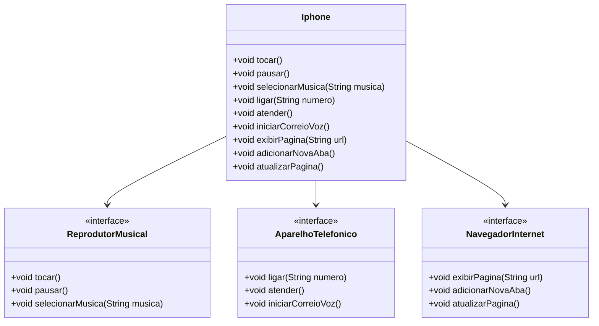

### Desafio proposto

Responsável por modelar e diagramar a representação UML do componente iPhone, abrangendo as funcionalidades com Reprodutor musical, aparelho telefônico e navegador de internet e então implementar em Java.

## UML

